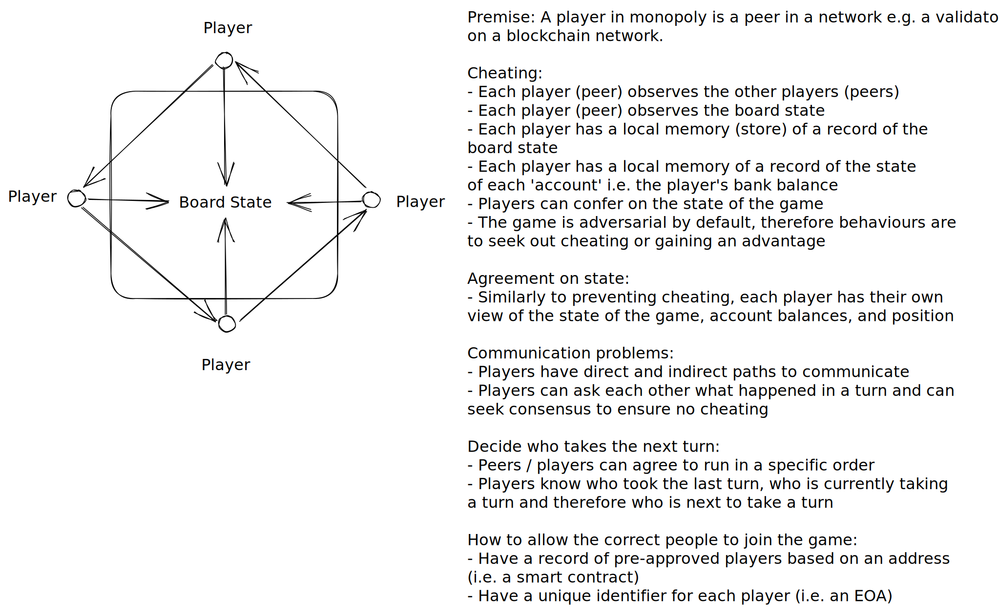

# Lesson 1 Homework

## Author

Stefan

## Question

### Decentralised Systems

Discuss in your teams what a decentralised version of a game like monopoly would be
like, if there was no software on a central server.
How would you solve the problems of

- cheating
- ensuring agreement about the state of the system
- communication problems (timeouts)
- how to decide who should take the next turn
- how to allow the correct people to join the game

This is just a general discussion, there is no need to write any code or do any detailed
design.

## Solution

Premise: A player in monopoly is a peer in a network e.g. a validator
on a blockchain network.

### Cheating:

- Each player (peer) observes the other players (peers)
- Each player (peer) observes the board state
- Each player has a local memory (store) of a record of the
  board state
- Each player has a local memory of a record of the state
  of each 'account' i.e. the player's bank balance
- Players can confer on the state of the game
- The game is adversarial by default, therefore behaviours are
  to seek out cheating or gaining an advantage

### Agreement on state:

- Similarly to preventing cheating, each player has their own
  view of the state of the game, account balances, and position

### Communication problems:

- Players have direct and indirect paths to communicate
- Players can ask each other what happened in a turn and can
  seek consensus to ensure no cheating

### Decide who takes the next turn:

- Peers / players can agree to run in a specific order
- Players know who took the last turn, who is currently taking
  a turn and therefore who is next to take a turn

### How to allow the correct people to join the game:

- Have a record of pre-approved players based on an address
  (i.e. a smart contract)
- Have a unique identifier for each player (i.e. an EOA)

### Supporting Diagram

