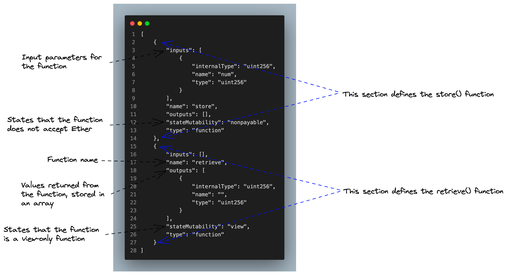

# Lesson 3 Homework

## Author

Stefan

## Question

### Using Remix

- Open Remix IDE : https://remix.ethereum.org
- Use the [simple storage contract](https://gist.github.com/extropyCoder/c0210a05d2e122c63bbe25d2477f95cd)
- Compile the contract
- Have a look at the ABI and the bytecode, do you understand how the ABI relates to your contract's code?

## Solution

### Supporting Diagram

This diagram labels the various elements of the smart contract ABI generated for the Storage contract.



### Storage Contract ABI

```
[
	{
		"inputs": [
			{
				"internalType": "uint256",
				"name": "num",
				"type": "uint256"
			}
		],
		"name": "store",
		"outputs": [],
		"stateMutability": "nonpayable",
		"type": "function"
	},
	{
		"inputs": [],
		"name": "retrieve",
		"outputs": [
			{
				"internalType": "uint256",
				"name": "",
				"type": "uint256"
			}
		],
		"stateMutability": "view",
		"type": "function"
	}
]
```

### Storage Contract Bytecode

```
608060405234801561001057600080fd5b50610150806100206000396000f3fe608060405234801561001057600080fd5b50600436106100365760003560e01c80632e64cec11461003b5780636057361d14610059575b600080fd5b610043610075565b60405161005091906100a1565b60405180910390f35b610073600480360381019061006e91906100ed565b61007e565b005b60008054905090565b8060008190555050565b6000819050919050565b61009b81610088565b82525050565b60006020820190506100b66000830184610092565b92915050565b600080fd5b6100ca81610088565b81146100d557600080fd5b50565b6000813590506100e7816100c1565b92915050565b600060208284031215610103576101026100bc565b5b6000610111848285016100d8565b9150509291505056fea2646970667358221220c56bac1319c398ebbbb8d030fce5455e792a1b63fe580ffcda65e8813a39067264736f6c63430008120033
```
